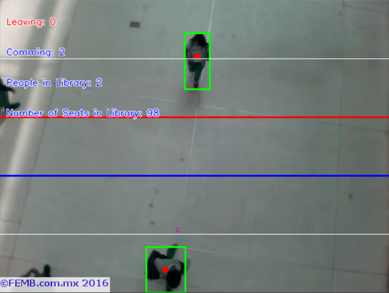

# Library People Detection Project Usign Python with OpenCV

This project uses object detection using opencv library, we can track people going in and out of library as well as people present in library, and no of seats vacant in library.



## ⚙️ Technologies used

-   🐍 Python
-   📷 OpenCV
-   🔢 Numpy

## 🚶🏻‍♂️ Getting started

```bash
# 1. Clone the repository
$ git clone https://github.com/naman22a/library-people-detection

# 2. Enter your newly-cloned folder.
$ cd library-people-detection

# 3. Install the dependencies with pip.
$ pip install requirements.txt

# 4. Run the program
$ python main.py
```

## 🗒️ License

[MIT LICENSED](./LICENSE)
